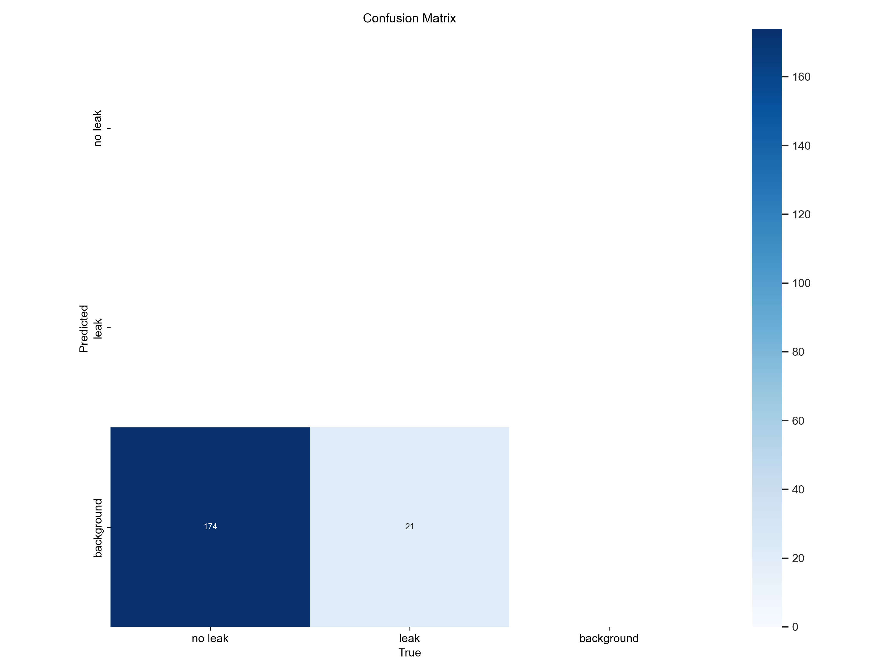
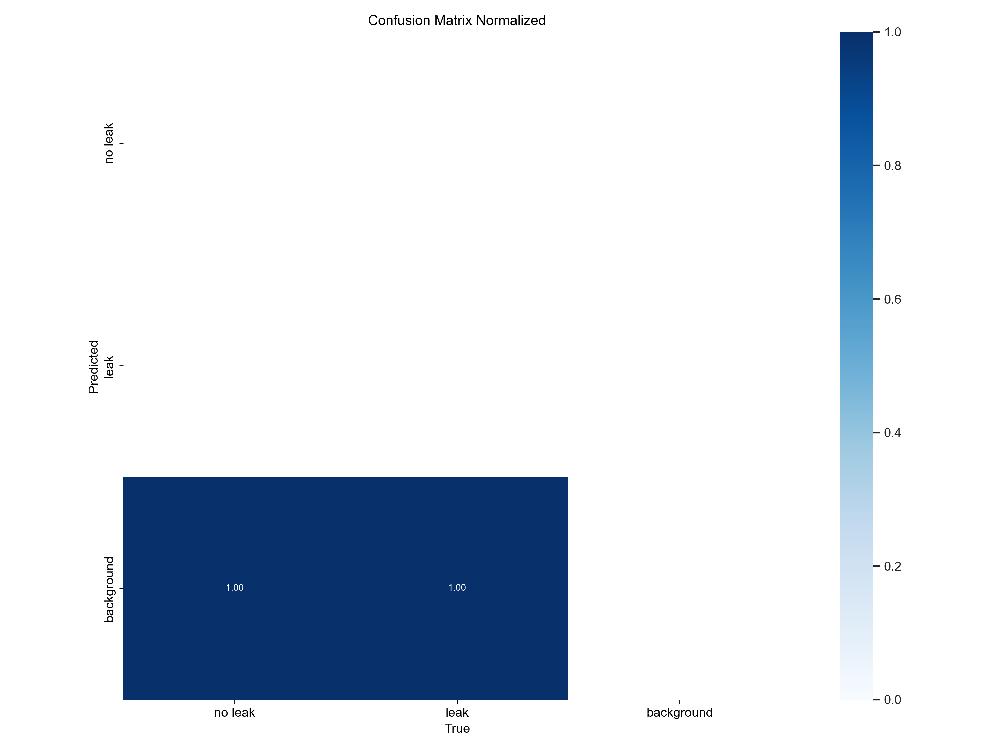
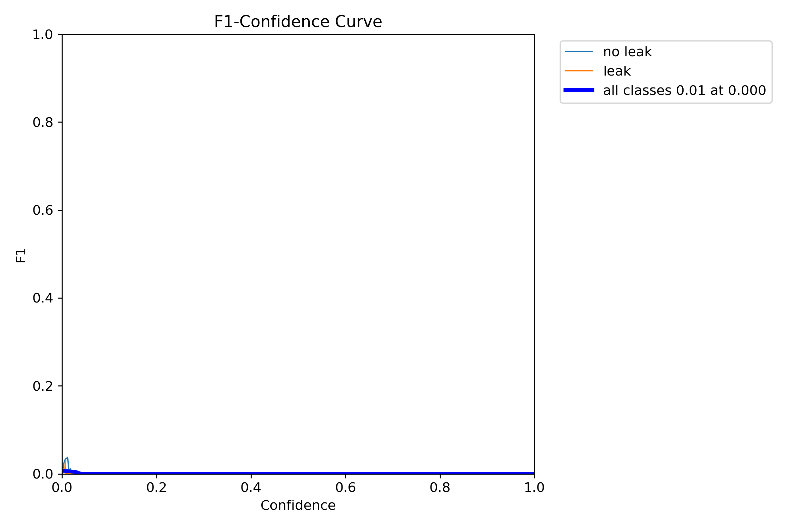
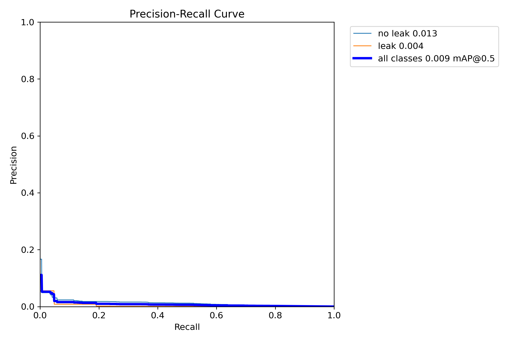
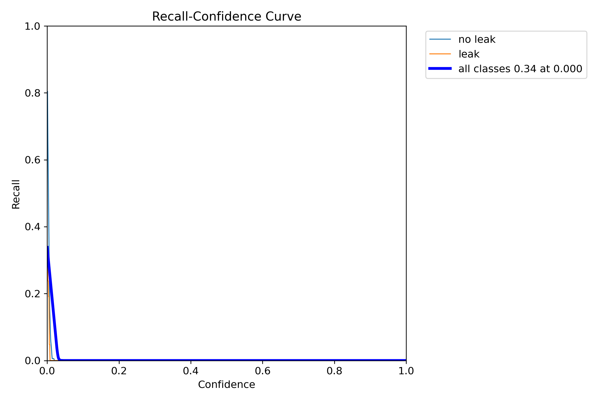
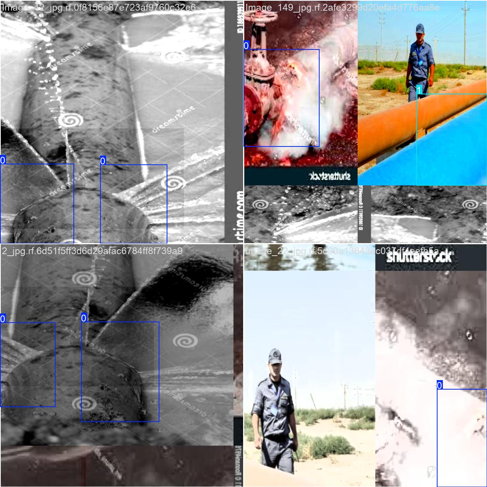
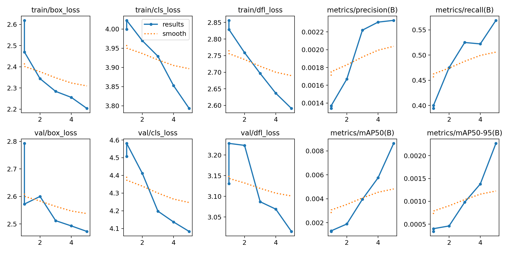

# Natural Gas Leak Detection using YOLO

## 🚀 Overview
This project uses **YOLO (You Only Look Once)** to detect **natural gas leaks** from pipeline images and videos. It applies **deep learning and computer vision** techniques to automate the detection process and improve safety measures.

## 📂 Dataset Structure
The dataset is structured as follows:
```
/data
 ├── train
 │   ├── images
 │   ├── labels
 ├── valid
 │   ├── images
 │   ├── labels
 ├── test
 │   ├── images
 │   ├── labels
```
It consists of images labeled as:
- **"leak"** → Pipeline images containing gas leaks.
- **"no leak"** → Normal pipeline images without leaks.

## ⚙️ Installation
### 1️⃣ Install Dependencies
Run the following command to install the required libraries:
```bash
pip install ultralytics torch torchvision matplotlib numpy
```

## 🎯 Training the YOLO Model
### 2️⃣ Train the Model
```python
from ultralytics import YOLO

# Load YOLOv8 model
model = YOLO("yolov8s.pt")

# Train the model
model.train(data="pipeline-leak-prediction/data.yaml", epochs=50, batch=16, imgsz=640)
```
The trained model and logs will be saved in `runs/train/exp/weights/best.pt`.

## 📊 Evaluation Metrics
### 📌 Confusion Matrix

This matrix shows the classification performance.

### 📌 Normalized Confusion Matrix

The normalized matrix provides a proportionate view of the classification results.

### 📌 F1-Confidence Curve

Illustrates the **F1-score** variation with confidence thresholds.

### 📌 Precision-Confidence Curve

Represents precision across confidence levels.

### 📌 Precision-Recall Curve

Shows the trade-off between precision and recall.

### 📌 Recall-Confidence Curve

Indicates recall performance at various confidence thresholds.

## 🛠️ Running Inference
### 3️⃣ Test the Model on Sample Images
```python
# Load trained model
model = YOLO("runs/train/exp/best.pt")

# Run inference on a test image
results = model("sample_image.jpg", show=True)
```

## 📸 Model Predictions
### 🔹 Sample Training Batch

Sample images from the training process.

### 🔹 Detection Results

Final detections on test images after model training.

## 🚀 Future Improvements
- **Use a larger dataset** to enhance generalization.
- **Experiment with different YOLO versions** (YOLOv8m, YOLOv8x) for improved accuracy.
- **Optimize for real-time deployment** using **ONNX or TensorRT**.

---
### **📌 Conclusion**
This project successfully applies **YOLOv8** for **natural gas leak detection** in pipelines. The model automates inspections and enhances safety monitoring through deep learning techniques.

💡 **Contributions & Feedback Welcome!**
